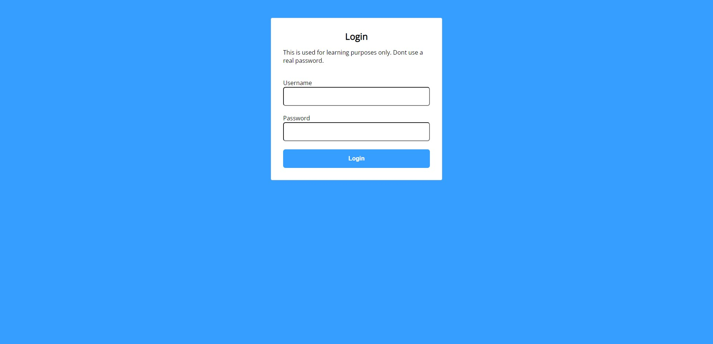
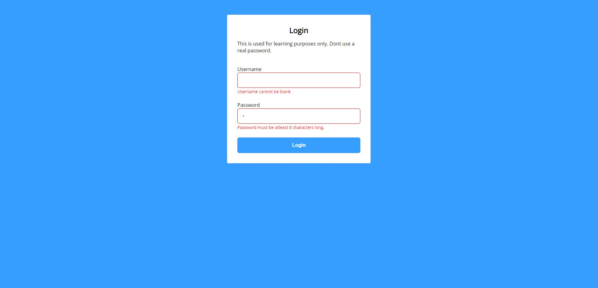

I followed a tutorial to complete this vanilla JS login screen & dashboard.

This was purely bit for learning purposes and is not a complete product. I believe that in order for this to work properly it will need a backend server along with encryption to safely store user data. Once again, this was created for the front end learning experience.

Screenshots of it working below

